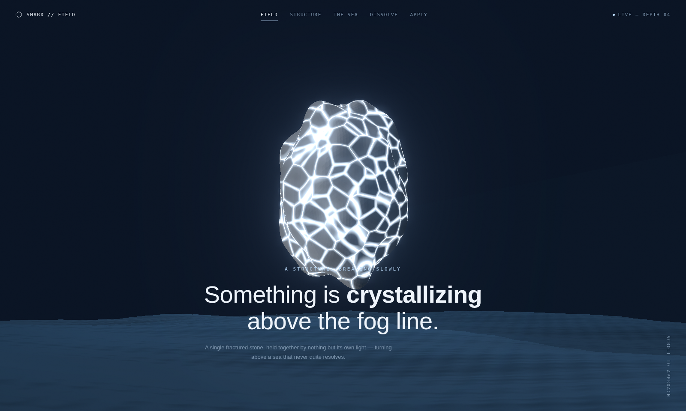

# Shard Horizon

A single fractured stone, held together by nothing but its own light, turning above a sea that never quite resolves.



## What it is

A one-page, scroll-driven landing site built around a live WebGL scene: a solid stone crossed by glowing procedural fracture veins, suspended above a layered, animated sea. Scroll past the hero and the stone dissolves into the six thousand points it was always made of, drifting upward as the page continues into a handful of content sections and a contact form.

No build step, no framework, no bundler. It's static HTML/CSS/JS that runs directly in the browser, using [Three.js](https://threejs.org/) loaded from a CDN via an import map.

## Structure

```
.
├── index.html        page markup, nav, content sections, and the application form
├── favicon.svg        tab icon
├── css/
│   └── style.css      all styling (nav, hero, panels, form, responsive layout)
├── js/
│   ├── state.js        tiny shared state (scroll fraction, pointer position)
│   ├── scene.js         all Three.js: the fractured stone, dissolve particles, the sea, render loop
│   └── main.js           DOM wiring: nav highlighting, scroll-reveal panels, mobile menu, form handling
├── docs/
│   └── screenshot.png    the image above
└── README.md
```

`scene.js` never touches the DOM; `main.js` never touches Three.js. They only share the small `state` object from `state.js`, updated each frame.

## Running it locally

Because it uses ES modules, open it through a local server rather than as a `file://` path:

```
python3 -m http.server 8000
```

then visit `http://localhost:8000`.

## Publishing

The repo name suggests GitHub Pages — check whether it's enabled under repository **Settings → Pages → Build and deployment → Source: Deploy from a branch**, branch `main`, folder `/ (root)`. Once enabled, the site publishes at `https://<username>.github.io/ventures.io/`.

## Notes

- The fracture pattern on the stone is generated procedurally with a 3D Worley-noise shader, not baked into the geometry — no two frames read exactly the same.
- Scrolling past the hero dissolves the stone into a particle field sampled from its own surface; each point already carries its own drift direction.
- The sea layers three wave octaves plus fine ripple noise, with foam appearing only on the steepest wave crests.
- The nav menu highlights the section currently in view and collapses into a slide-out panel below 860px.
- The application form validates name and email client-side; there's no backend wired up yet, so submissions aren't sent anywhere — the flow is ready to drop behind a real endpoint.
- Respects `prefers-reduced-motion`: the stone's rotation and the camera's orbit speed are both reduced.
